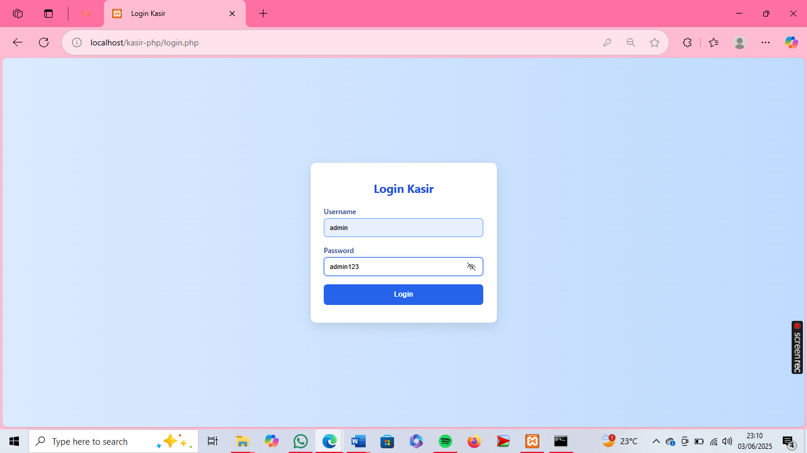

# 🧪 BLACKBOX TESTING 

Pengujian dilakukan menggunakan metode **Blackbox Testing**, yaitu pengujian berdasarkan fungsionalitas tanpa melihat kode sumber. Fokus utama pengujian ini adalah untuk memastikan bahwa aplikasi kasir berjalan sesuai harapan dari sisi pengguna.

---

## 🖼️ Tampilan Repositori GitHub

Berikut ini adalah tampilan repositori GitHub tempat kode aplikasi kasir dan hasil pengujian disimpan:

 
 
 
 
 
 
 
 

**Keterangan:**
- Repositori bernama `Pengujian-Aplikasi-Kasir`
- Tersedia tombol `Add file` untuk menambahkan file pengujian
- File seperti `README.md`, kode kasir, dan dokumen uji dapat dikelola di sini

---

## 🔐 LOGIN TEST CASE

Pengujian fitur login untuk memastikan bahwa hanya pengguna dengan kredensial valid yang bisa masuk ke sistem.

| Test Case ID | Test Case                    | Input Username | Input Password | Ekspektasi Output                         | Model        |
|--------------|------------------------------|----------------|----------------|-------------------------------------------|--------------|
| TC-1         | Login berhasil               | admin          | admin123       | Masuk ke dashboard                        | Equivalence  |
| TC-2         | Password kosong              | admin          | (kosong)       | Field: password wajib diisi               | Boundary     |
| TC-3         | Username kosong              | (kosong)       | admin123       | Field: username wajib diisi               | Boundary     |
| TC-4         | Username & password salah    | admin123       | admin          | Error: username & password salah          | Equivalence  |

---

## 📦 TAMBAH PRODUK

Pengujian fitur untuk menambah produk ke sistem kasir.

| Test Case ID | Test Case                      | Input                             | Ekspektasi Output                                               | Model       |
|--------------|--------------------------------|-----------------------------------|-----------------------------------------------------------------|-------------|
| TC-1         | Tambah produk valid            | Nama, harga, stok                 | Produk berhasil ditambahkan                                     | Equivalence |
| TC-2         | Nama produk kosong             | Nama = -, harga, stok             | Error: nama produk wajib diisi                                  | Equivalence |
| TC-3         | Harga dikosongkan              | Nama, harga = -, stok             | Error: harga wajib diisi                                        | Equivalence |
| TC-4         | Stok negatif                   | Nama, harga, stok = -1            | Error: nilai harus ≥ 0                                          | BVA         |
| TC-5         | Harga & stok besar (valid)     | Nama, harga = 100000, stok = 9999 | Produk berhasil ditambahkan                                     | Equivalence |

---

## 💳 TRANSAKSI

Pengujian proses transaksi.

| Test Case ID | Test Case                 | Input                                      | Ekspektasi Output                                     | Model          |
|--------------|---------------------------|--------------------------------------------|------------------------------------------------------|----------------|
| TC-1         | Transaksi berhasil        | Produk tersedia, stok cukup, bayar cukup   | Transaksi berhasil, riwayat transaksi tercatat       | Decision table |
| TC-2         | Jumlah melebihi stok      | Jumlah > stok                              | Error: stok tidak mencukupi                          | Boundary       |
| TC-3         | Field jumlah kosong       | 0                                          | Error: tidak ada item valid yang disimpan            | Boundary       |
| TC-4         | Input jumlah negatif      | negatif                                    | Error: jumlah tidak valid                            | Equivalence    |

---

## ✅ KESIMPULAN

Pengujian ini menunjukkan bahwa:
- Sistem sudah menangani input valid dan tidak valid dengan baik.
- Validasi untuk form login, tambah produk, dan transaksi bekerja sesuai harapan.
- Aplikasi kasir cukup stabil dan siap digunakan secara fungsional.

---

