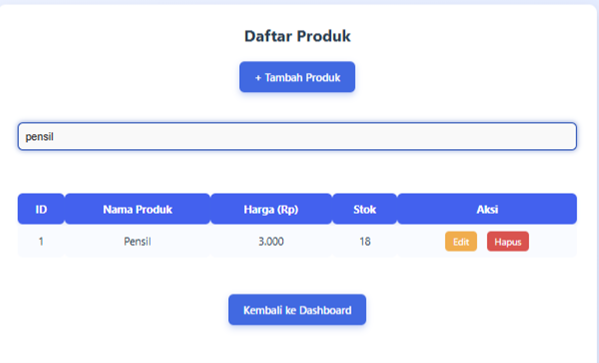
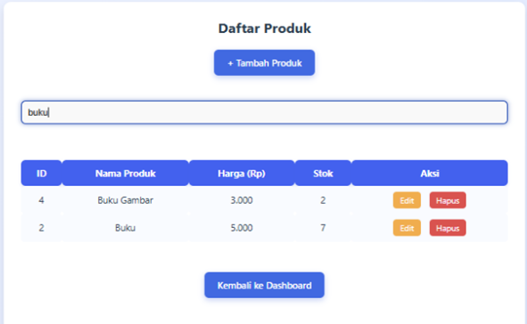
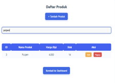
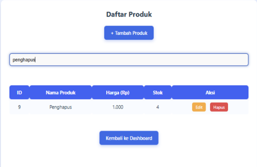
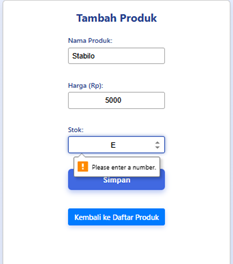

# 🧩 GREY BOX TESTING

## ✅ Orthogonal Array Testing

### 🔐 Fitur Login

| No | Skenario Uji     | Input Username | Input Password | Langkah Pengujian                      | Hasil yang Diharapkan                 | Status |
|----|------------------|----------------|----------------|----------------------------------------|----------------------------------------|--------|
| 1  | Login            | admin          | admin123       | Pengisian form login dan klik login   | Dialihkan ke Dashboard                | valid  |
| 2  | Username Salah   | ratna          | 123456         | Pengisian form login dan klik login   | Tampil pesan error "Username dan Password salah" | valid |

---

### ➕ Fitur Tambah Produk

| No | Nama Produk   | Harga Produk | Stok | Status |
|----|---------------|--------------|------|--------|
| 1  | Pensil        | 3000         | 18   | valid     |
| 2  | Buku          | 5000         | 9    | valid     |
| 3  | Pulpen        | 4000         | 15   | valid     |
| 4  | Buku Gambar   | 3000         | 3    | valid     |
| 5  | Tipe X        | 5000         | 2    | valid     |
| 6  | White Board   | 15000        | 8    | valid     |
| 7  | Origami       | 10000        | 10   | valid     |
| 8  | HVS           | 500          | 10   | valid     |
| 9  | Penghapus     | 1000         | 5    | valid     |

---

### 💳 Fitur Transaksi Baru

| No | Nama Produk   | Jumlah Produk | Harga Produk | Total Transaksi | Status |
|----|---------------|----------------|---------------|------------------|--------|
| 1  | Pensil        | 2              | 3000          | 6000             | valid       |
| 2  | Buku          | 3              | 5000          | 15000            | valid       |
| 3  | Buku Gambar   | 1              | 3000          | 3000             | valid       |
| 4  | Penghapus     | 1              | 1000          | 1000             | valid       |
| 5  | Pulpen        | 1              | 4000          | 4000             | valid       |

---

## 📊 Matrix Testing

### Definisikan Parameter dan Kondisi:
- **Parameter**: Nama produk, Harga produk, Kategori produk  
- **Kondisi**: Kombinasi parameter (nama produk + harga produk + kategori produk)

### Tabel Matriks:

| Nama Produk   | Harga Produk | Kategori Produk | Status |
|---------------|--------------|------------------|--------|
| Pensil        | 3000         | ATK              | valid       |
| Buku          | 5000         | ATK              | valid       |
| Pulpen        | 4000         | ATK              | valid       |
| Penghapus     | 1000         | ATK              | valid       |

- 
- 

**Analisa Hasil Test:**
- Kombinasi dari parameter dan kondisi berhasil dalam tahap pencarian.
- Produk bisa ditambahkan, di-edit, dan dihapus.
- Transaksi baru bisa dilakukan.

---

## ♻️ Regression Testing

### Fitur Baru yang Ditambahkan:
- Fitur Kategori Produk
- Fitur Struk Belanja
- Fitur Diskon Produk

### Contoh Pengujian Fitur Diskon Produk

| No | Fitur yang Diuji                 | Langkah Pengujian                                         | Hasil yang Diharapkan                          |
|----|----------------------------------|-----------------------------------------------------------|------------------------------------------------|
| 1  | Tambah Produk tanpa diskon       | Tambahkan produk tanpa diskon                            | Produk ditambahkan dengan harga normal         |
| 2  | Hitung Total Transaksi           | Beli 3 produk tanpa diskon                                | Total = jumlah x harga                         |
| 3  | Riwayat Transaksi                | Cek tampilan detail transaksi                             | Data produk dan subtotal tampil normal         |
| 4  | Tambah Produk dengan Diskon      | Tambah "Whiteboard" harga 15000, diskon 50%               | Subtotal jadi 7500 dan ditampilkan dengan benar |

---

## 🐞 Bug/Gangguan yang Ditemukan

> Pada halaman **Tambah Produk**, ditemukan bug saat mengisi **input stok**:
- Meskipun input bertipe `number`, pengguna masih bisa mengetik karakter huruf (misalnya "E").
- Browser hanya memberikan pesan: *"Please enter a number."*

### ✅ Solusi:
- Gunakan atribut HTML input yang benar (`type="number"`).
- Tambahkan **validasi di sisi server (PHP)**.
- Tambahkan **petunjuk/placeholder** pada form.
- Terapkan **validasi JavaScript** agar lebih interaktif.

---

## 🧪 Model Pattern Testing

| No | Pattern                       | Contoh Skenario Uji                                      | Hasil yang Diharapkan                                        |
|----|-------------------------------|-----------------------------------------------------------|--------------------------------------------------------------|
| 1  | Input kosong                  | Menyimpan produk tanpa mengisi “Nama Produk” dan “Harga” | Sistem menampilkan pesan error dan tidak menyimpan data.     |
| 2  | Input non-numerik di kolom angka | Mengetik huruf pada kolom “Stok”                         | Sistem memblokir input atau memberikan pesan validasi.        |

---
