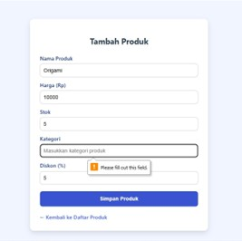

# Laporan Grey Box Testing Perbaikan

## 1. Orthogonal Array Testing

Orthogonal Array Testing adalah teknik pengujian perangkat lunak yang menggunakan array orthogonal untuk membuat kasus uji. Ini adalah pendekatan pengujian statistik yang sangat berguna ketika sistem yang akan diuji memiliki input data yang besar. Pengujian susunan orthogonal membantu memaksimalkan cakupan pengujian dengan memasangkan dan menggabungkan input serta menguji sistem.

### Fitur Login

| No | Skenario Uji | Username | Password | Langkah Pengujian | Hasil yang Diharapkan |
|----|--------------|----------|----------|--------------------|------------------------|
| 1 | Login | admin | ratna25803 | Isi form login, klik login | Dialihkan ke Dashboard |
| 2 | Login | admin | 123456 | Isi form login, klik login | Tampil error “Password salah” |
| 3 | Login | user | ratna25803 | Isi form login, klik login | Tampil error “Username salah” |
| 4 | Login | admin | (kosong) | Login tanpa password | Tampil error “Password wajib diisi” |
| 5 | Login | (kosong) | ratna25803 | Login tanpa username | Tampil error “Username wajib diisi” |
| 6 | Login | admin | admin | Login dengan kombinasi salah | Tampil error “Password salah” |
| 7 | Login | Admin1 | ratna25803 | Username salah | Tampil error |
| 8 | Login | ADMIN | RATNA25803 | Semua huruf kapital | Tampil error |
| 9 | Login | 'OR 1=1-- | bebas | Uji SQL Injection | Tampil error, username dan password tidak sesuai |

### Fitur Tambah Produk

| No | Skenario Uji | Nama Produk | Harga | Stok | Kategori | Diskon | Langkah Pengujian | Hasil yang Diharapkan |
|----|--------------|--------------|--------|------|----------|--------|--------------------|------------------------|
| 1 | Input Valid | Buku | 5000 | 8 | ATK | 5% | Isi semua form, klik simpan | Produk berhasil ditambahkan |
| 2 | Nama Kosong | (kosong) | 3000 | 4 | ATK | 0% | Kosongkan nama | Tampil error “nama wajib diisi” |
| 3 | Harga Kosong | Penggaris | (kosong) | 5 | ATK | 3% | Kosongkan harga | Tampil error “harga wajib diisi” |
| 4 | Stok Kosong | Pensil warna | 25000 | (kosong) | ATK | 0 | Kosongkan stok | Tampil error “stok wajib diisi” |
| 5 | Kategori Kosong | Origami | 10000 | 5 | (kosong) | 5% | Kosongkan kategori | Tampil error “kategori wajib diisi” |
| 6 | Diskon > 100 | HVS | 50000 | 10 | ATK | 150% | Diskon lebih dari 100 | Tampil error “diskon maksimal 100%” |
| 7 | Diskon Huruf | Tipe X | 5000 | 1 | ATK | abc | Diskon huruf | Tampil error “diskon harus angka” |
| 8 | Semua Kosong | - | - | - | - | - | Klik simpan tanpa isi | Tampil error “semua field wajib diisi” |
| 9 | Diskon Kosong | Penghapus | 2000 | 15 | ATK | (kosong) | Kosongkan diskon | Tampil error “diskon wajib diisi” |

### Fitur Transaksi Baru

| No | Skenario Uji | Produk | Jumlah | Metode Pembayaran | Uang Tunai | Langkah Pengujian | Hasil yang Diharapkan |
|----|--------------|--------|--------|--------------------|------------|--------------------|------------------------|
| 1 | Input valid satu produk | Pensil | 2 | Tunai | 6000 | Isi dan simpan | Transaksi berhasil, struk dicetak |
| 2 | Multi produk | Buku & pulpen | 1,1 | Tunai | 9500 | Isi dan simpan | Transaksi berhasil, struk dicetak |
| 3 | Jumlah kosong | Pensil | - | Tunai | 3000 | Kosongkan jumlah | Tampil error “jumlah produk wajib diisi” |
| 4 | Jumlah = 0 | Penggaris | 0 | Tunai | 4000 | Isi jumlah 0 | Tampil error “jumlah harus > 0” |
| 5 | Melebihi stok | Tipe X | 5 | Tunai | 5000 | Jumlah > stok | Tampil error “jumlah melebihi stok” |
| 6 | Uang kosong | Origami | 1 | Tunai | - | Kosongkan uang tunai | Tampil error “uang tunai wajib diisi” |
| 7 | Uang kurang | Penghapus | 2 | Tunai | 2000 | Uang < total | Tampil error “uang tidak mencukupi” |
| 8 | Metode kosong | HVS | 1 | - | 5000 | Kosongkan metode | Tampil error “pilih metode pembayaran” |
| 9 | Metode QRIS | Pensil warna | 1 | QRIS | - | Pilih QRIS | Transaksi berhasil, struk dicetak |

---

## 2. Matrix Testing

**Parameter:**
- Nama produk: Buku, Pensil, Pulpen, dll
- Harga: Harga satuan produk
- Stok: Jumlah stok awal produk
- Kategori: Pengelompokan produk
- Diskon: Dalam bentuk persentase

**Kondisi:**
Kombinasi dari semua parameter di atas.

**Contoh Tabel Matrix Testing:**

| No | Skenario Uji | Nama Produk | Harga | Stok | Kategori | Diskon | Hasil yang Diharapkan | Status |
|----|--------------|--------------|--------|------|----------|--------|------------------------|--------|
| 1 | Input Valid | Buku | 5000 | 8 | ATK | 5% | Produk berhasil ditambahkan | ✅ |
| 2 | Nama Kosong | (kosong) | 3000 | 4 | ATK | 0% | Tampil error “nama wajib diisi” | ✅ |
| ... | ... | ... | ... | ... | ... | ... | ... | ✅ |

---

## 3. Regression Testing

Menjalankan Test Case

 
 

---
## 4. Regression Testing

Menambahkan fitur-fitur baru:

- **Diskon**: ditampilkan dalam bentuk persentase di tabel transaksi dan dihitung otomatis saat subtotal.
- **Kategori**: pengelompokan produk untuk mempermudah pencarian.
- **Metode Pembayaran**: mendukung QRIS, Tunai, Transfer, dll.
- **Cetak Struk**: ringkasan transaksi yang rapi dan bisa dicetak.

---

## 5. Pattern Testing

### a. Pengujian Fungsional Dasar

- Tambah produk
- Lakukan transaksi
- Edit & hapus produk
- Cetak struk

### b. Pengujian Batasan & Skenario Tidak Terduga

- Nama produk panjang/singkat
- Input salah format (mis. diskon huruf)
- Duplikasi produk
- Transaksi tanpa produk

### c. Pengujian Performa & Stabilitas

- Tambah banyak data
- Transaksi cepat berulang
- Respons pencarian
- Cetak struk berturut-turut
- Uji lintas browser/perangkat

### d. Pengujian Kegunaan & UX

- Uji kemudahan navigasi
- Uji keterbacaan info
- Minta umpan balik pengguna

---
