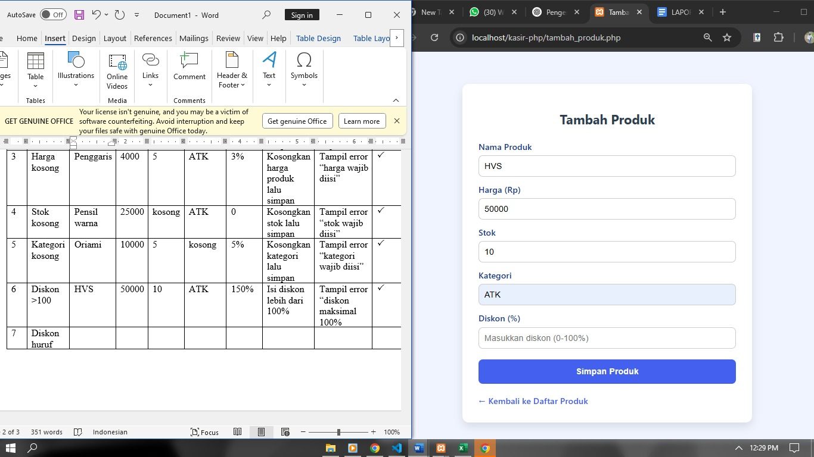
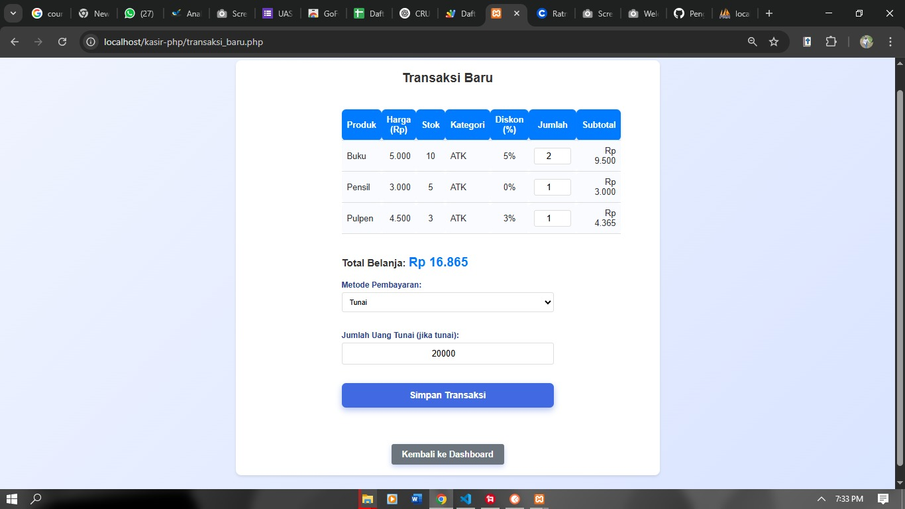
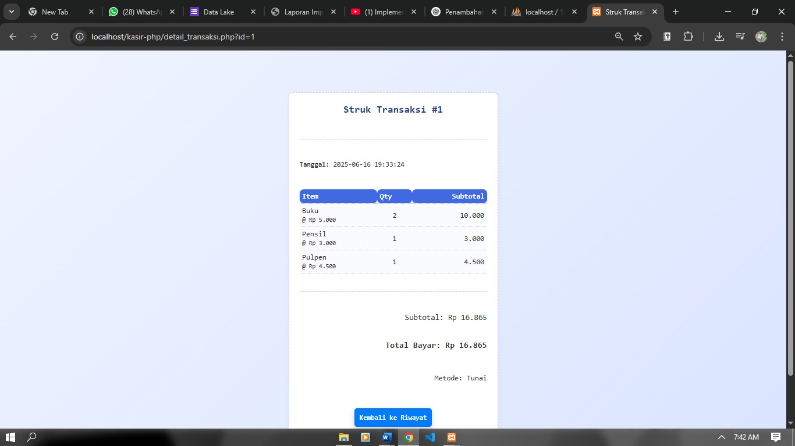

# 📋 Laporan Grey Box Testing

## 1. Orthogonal Array Testing

### 🔐 Fitur Login

| No | Skenario Uji | Input Username | Input Password | Langkah Pengujian | Hasil yang Diharapkan |
|----|---------------|----------------|----------------|--------------------|-------------------------|
| 1  | Login         | admin          | ratna25803     | Isi form login dan klik login | Dialihkan ke Dashboard |
| 2  | Login         | admin          | 123456         | Isi form login dan klik login | Tampil pesan error “Password salah” |
| 3  | Login         | user           | ratna25803     | Isi form login dan klik login | Tampil pesan error “Username salah” |
| 4  | Login         | admin          | (kosong)       | Isi form login tanpa password | Tampil pesan error “Password wajib diisi” |
| 5  | Login         | (kosong)       | ratna25803     | Isi form login tanpa username | Tampil pesan error “Username wajib diisi” |
| 6  | Login         | admin          | admin          | Isi form login dan klik login | Tampil pesan error “Password salah” |
| 7  | Login         | Admin1         | ratna25803     | Isi form login (username salah) | Tampil pesan error |
| 8  | Login         | ADMIN          | RATNA25803     | Semua huruf kapital | Tampil pesan error |
| 9  | Login         | `'OR 1=1--`    | bebas          | Uji SQL Injection | Tampil pesan error: username dan password tidak sesuai |

---

### 🛒 Fitur Tambah Produk

| No | Skenario Uji       | Nama Produk   | Harga | Stok | Kategori | Diskon | Langkah Pengujian | Hasil yang Diharapkan |
|----|---------------------|---------------|-------|------|----------|--------|--------------------|------------------------|
| 1  | Input Valid         | Buku          | 5000  | 8    | ATK      | 5%     | Isi semua form dan simpan | Produk berhasil ditambahkan |
| 2  | Nama Kosong         | (kosong)      | 3000  | 4    | ATK      | 0%     | Nama kosong, klik simpan | Tampil error “nama wajib diisi” |
| 3  | Harga kosong        | Penggaris     |       | 5    | ATK      | 3%     | Harga kosong, klik simpan | Tampil error “harga wajib diisi” |
| 4  | Stok kosong         | Pensil warna  | 25000 |      | ATK      | 0      | Stok kosong, klik simpan | Tampil error “stok wajib diisi” |
| 5  | Kategori kosong     | Origami       | 10000 | 5    | (kosong) | 5%     | Kategori kosong, klik simpan | Tampil error “kategori wajib diisi” |
| 6  | Diskon > 100%       | HVS           | 50000 | 10   | ATK      | 150%   | Diskon > 100%, klik simpan | Tampil error “diskon maksimal 100%” |
| 7  | Diskon huruf        | Tipe X        | 5000  | 1    | ATK      | abc    | Diskon huruf, klik simpan | Tampil error “diskon harus angka” |
| 8  | Semua kosong        | -             | -     | -    | -        | -      | Klik simpan tanpa isi form | Tampil error “semua field wajib diisi” |
| 9  | Diskon kosong       | Penghapus     | 2000  | 15   | ATK      | -      | Diskon kosong, klik simpan | Tampil error “diskon wajib diisi” |

---

### 💳 Fitur Transaksi Baru

| No | Skenario Uji                   | Produk Dibeli     | Jumlah | Metode Pembayaran | Uang Tunai | Langkah Pengujian | Hasil yang Diharapkan |
|----|--------------------------------|-------------------|--------|-------------------|------------|--------------------|------------------------|
| 1  | Input valid satu produk        | Pensil            | 2      | Tunai             | 6000       | Isi produk, isi uang, simpan | Transaksi berhasil & cetak struk |
| 2  | Input valid multi produk       | Buku & Pulpen     | 1,1    | Tunai             | 9500       | Isi semua form, simpan | Transaksi berhasil & cetak struk |
| 3  | Jumlah produk kosong           | Pensil            |        | Tunai             | 3000       | Jumlah kosong, klik simpan | Tampil error “jumlah produk wajib diisi” |
| 4  | Jumlah produk 0                | Penggaris         | 0      | Tunai             | 4000       | Jumlah = 0, klik simpan | Tampil error “jumlah produk harus > 0” |
| 5  | Jumlah melebihi stok           | Tipe X            | 5      | Tunai             | 5000       | Jumlah > stok, simpan | Tampil error “jumlah melebihi stok tersedia” |
| 6  | Uang tunai kosong              | Origami           | 1      | Tunai             | -          | Uang kosong, simpan | Tampil error “uang tunai wajib diisi” |
| 7  | Uang tunai kurang              | Penghapus         | 2      | Tunai             | 2000       | Uang < total, klik simpan | Tampil error “uang tidak mencukupi” |
| 8  | Metode pembayaran belum dipilih| HVS               | 1      | -                 | 5000       | Metode kosong, simpan | Tampil error “pilih metode pembayaran” |
| 9  | Metode non-tunai               | Pensil warna      | 1      | QRIS              | -          | Isi produk, pilih QRIS, simpan | Transaksi berhasil & cetak struk |

---

## 2. Matrix Testing

### 📌 Parameter & Kondisi

- **Nama Produk**: Buku, pensil, pulpen, dll  
- **Harga**: Harga satuan produk  
- **Stok**: Jumlah stok produk  
- **Kategori**: Pengelompokkan produk  
- **Diskon**: Dalam bentuk persentase (%)

### 📊 Tabel Matrix

| No | Skenario Uji    | Nama Produk | Harga | Stok | Kategori | Diskon | Langkah Pengujian | Hasil yang Diharapkan | Status |
|----|------------------|--------------|--------|------|-----------|--------|--------------------|------------------------|--------|
| 1  | Input Valid      | Buku         | 5000   | 8    | ATK       | 5%     | Isi valid lalu simpan | Produk berhasil ditambahkan | ✔️ |
| 2  | Nama Kosong      | (kosong)     | 3000   | 4    | ATK       | 0%     | Nama kosong lalu simpan | Tampil error “nama wajib diisi” | ✔️ |
| 3  | Harga kosong     | Penggaris    | -      | 5    | ATK       | 3%     | Harga kosong lalu simpan | Tampil error “harga wajib diisi” | ✔️ |
| 4  | Stok kosong      | Pensil warna | 25000  | -    | ATK       | 0      | Stok kosong lalu simpan | Tampil error “stok wajib diisi” | ✔️ |
| 5  | Kategori kosong  | Origami      | 10000  | 5    | -         | 5%     | Kategori kosong lalu simpan | Tampil error “kategori wajib diisi” | ✔️ |
| 6  | Diskon > 100     | HVS          | 50000  | 10   | ATK       | 150%   | Diskon > 100% lalu simpan | Tampil error “diskon maksimal 100%” | ✔️ |
| 7  | Diskon huruf     | Tipe X       | 5000   | 1    | ATK       | abc    | Diskon huruf lalu simpan | Tampil error “diskon harus angka” | ✔️ |
| 8  | Semua kosong     | -            | -      | -    | -         | -      | Simpan tanpa isi apa pun | Tampil error “semua field wajib diisi” | ✔️ |
| 9  | Diskon kosong    | Penghapus    | 2000   | 15   | ATK       | -      | Diskon kosong, simpan | Tampil error “diskon wajib diisi” | ✔️ |

---

## 3. Menjalankan Test Case

- 

- 

- 

- 

---

## 4. Regression Testing

### ✨ Fitur Baru yang Ditambahkan

- 

1. **Diskon**:  
   - Ditampilkan sebagai persentase di tabel transaksi  
   - Otomatis diterapkan saat perhitungan subtotal

2. **Kategori**:  
   - Menampilkan jenis produk untuk pengelompokan  
   - Mempermudah pencarian dan pengelolaan produk

3. **Metode Pembayaran**:  
   - Mendukung QRIS, tunai, transfer  
   - Pengguna bisa memilih metode sesuai kebutuhan

4. **Cetak Struk**:  
   - Menampilkan ringkasan transaksi lengkap  
   - Termasuk: nomor, tanggal, item, harga, qty, total, metode pembayaran  
   - Disertai tombol “Kembali ke Riwayat”

---

## 5. Pattern Testing

### ✅ Uji Fungsional Dasar
- Tambah, edit, hapus produk
- Transaksi dan cetak struk
- Validasi diskon dan harga
- Perubahan tersimpan dengan benar

### ⚠️ Uji Batasan & Error
- Nama panjang/pendek
- Karakter tidak valid pada harga/diskon
- Stok negatif
- Produk duplikat
- Transaksi tanpa produk

### 🔄 Uji Performa & Stabilitas
- Transaksi berulang
- Tambah banyak data
- Cetak struk beruntun
- Kompatibel lintas browser/device

### 👤 Uji Pengalaman Pengguna
- Layout intuitif
- Navigasi mudah dipahami
- Informasi jelas dan mudah dibaca
- Uji oleh pengguna awam

---

