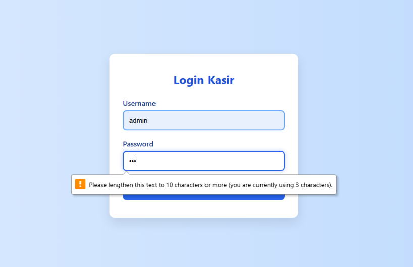
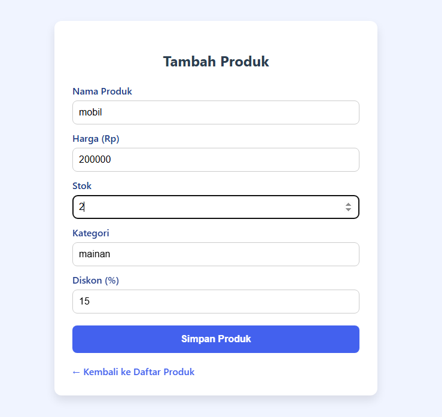

# ✅ Laporan Perbaikan: White Box Testing

Dokumen ini berisi hasil dan perbaikan yang dilakukan berdasarkan proses **White Box Testing** terhadap sistem aplikasi yang telah diperbaiki.

---

## 🧪 Ringkasan Pengujian

White Box Testing dilakukan untuk mengevaluasi logika internal dari kode program, memastikan setiap jalur logika berjalan sebagaimana mestinya dan sesuai dengan kebutuhan sistem.

---

## 🔧 Daftar Perbaikan

### 1. Modul Login
- **Masalah:** Sistem tidak memiliki validasi panjang password yang memadai.
- **Perbaikan:**  
  - Ditambahkan validasi agar **password minimal memiliki 10 karakter**.
  - Hal ini meningkatkan keamanan sistem login.
  - 

### 2. Modul Tambah Produk
- **Masalah:** Input stok sebelumnya dapat menerima karakter non-angka.
- **Perbaikan:**  
  - Validasi input diperketat agar **hanya angka** yang dapat dimasukkan ke dalam kolom stok.
  - Mencegah potensi kerusakan atau kesalahan dalam data produk.
  - 
---

## 📌 Catatan Tambahan

- Pengujian dilakukan secara menyeluruh pada fungsi-fungsi utama yang bersifat kritikal.
- Perbaikan telah diuji ulang untuk memastikan bahwa bug tidak muncul kembali dan validasi berjalan sesuai harapan.

